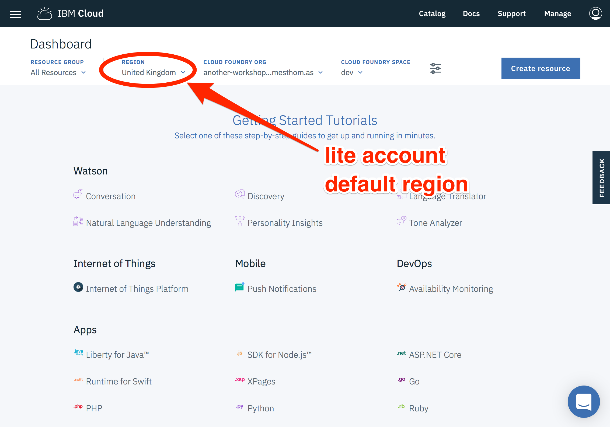
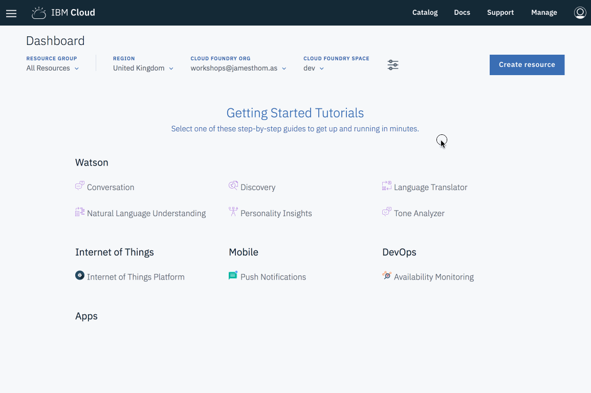

# setting up dev environment

This exercise will set up your local development environment to use IBM Cloud Functions. These steps are a prerequisite before you can start building serverless applications.

*Once you have completed this exercise, you will have…*

- **Registered an IBM Cloud account.**
- **Installed and configured IBM Cloud CLI tools.**
- **Tested example IBM Cloud Functions action from the command-line.**

Once this exercise is finished, we can start to develop serverless applications using IBM Cloud Functions!

## Table Of Contents

* [Register IBM Cloud Account](#register-ibm-cloud-account)
* [Check Default Region (Lite Account Users)](#check-default-region-(lite-account-users))
* [Install IBM Cloud CLI](#install-ibm-cloud-cli)
* [Log Into IBM Cloud CLI](#log-into-ibm-cloud-cli)
* [Install IBM Cloud Functions CLI plugin](#install-ibm-cloud-functions-cli-plugin)
* [Test IBM Cloud Functions From The CLI](#test-ibm-cloud-functions-from-the-cli)

## Instructions

### Register IBM Cloud Account

1. Open a browser window 

2. Navigate to [https://console.bluemix.net/registration/](https://ibm.biz/BdZf65)

   

3. Fill in registration form and follow link in the validation email when it arrives.

   

4. [Login into IBM Cloud](https://console.bluemix.net/login) using the account credentials you have registered.

### Check Default Region (Lite Account Users)

New IBM Cloud accounts default to a [new "lite" account version](https://www.ibm.com/cloud/pricing). 

*This account provides free access to a subset of IBM Cloud resources, including IBM Cloud Functions. Lite accounts do not need a credit-card to sign up or expire after a set time period, i.e. 30 days.*

Developers using "*Lite accounts*" are restricted to development within a single region. Accounts are automatically assigned to either `eu-gb` or `us-south` regions depending on user profile location.

**When setting up the IBM Cloud CLI, choose the API endpoint for the default account region.**

Follow these instructions to check which default region your lite account has been assigned.

1. Open the [IBM Cloud homepage](https://console.bluemix.net/).
2. Check the "*Region*" drop-down value in the page header.



*Accounts which have been upgraded to "Pay-As-You-Go" or "Subscription" can choose any available region for IBM Cloud Functions.*

### Install IBM Cloud CLI

1. Open the [IBM Cloud Docs](https://console.bluemix.net/docs/) page.

2. Open the *"CLI and Dev Tools"* link from the *"IBM Cloud"* section.

3. Click on the *"Get Started"* image under *"IBM Cloud CLI"* section.

4. Follow the steps 1 and 2 from this page to download and install the IBM Cloud CLI .

   

   ​

### Log Into IBM Cloud CLI

1. Use this command to authenticate the IBM Cloud CLI with your account credentials.

   ```
   $ bx login
   ```

2. Choose an API endpoint from the list.
   ***IBM Cloud Functions is available in the following regions: `eu-de`, `eu-gb` and `us-south`. Lite account users must choose their default account region.***

   ```
   Select an API endpoint:
   1. eu-de - https://api.eu-de.bluemix.net
   2. au-syd - https://api.au-syd.bluemix.net
   3. us-east - https://api.us-east.bluemix.net
   4. us-south - https://api.ng.bluemix.net
   5. eu-gb - https://api.eu-gb.bluemix.net
   6. Enter a different API endpoint
   Enter a number> 
   ```

3. Enter account credentials for your IBM Cloud account.

   ```
   Email> user@email.com

   Password>
   Authenticating...
   OK

   Select an account (or press enter to skip):
   1. John Smith's Account (xxx)
   Enter a number>

   API endpoint:     https://api.eu-gb.bluemix.net (API version: 2.92.0)
   Region:           eu-gb
   User:             user@email.com
   Account:          No account targeted, use 'bx target -c ACCOUNT_ID'
   Resource group:   No resource group targeted, use 'bx target -g RESOURCE_GROUP'
   Org:
   Space:

   ```

4. Run the following command to configure the organisation and space the CLI is targeting.

   ```
   $ bx target --cf
   Targeted org user@email.com
   Targeted space dev

   API endpoint:     https://api.eu-gb.bluemix.net (API version: 2.92.0)
   Region:           eu-gb
   User:             user@email.com
   Account:          No account targeted, use 'bx target -c ACCOUNT_ID'
   Resource group:   No resource group targeted, use 'bx target -g RESOURCE_GROUP'
   Org:              user@email.com
   Space:            dev
   ```

### Install IBM Cloud Functions CLI plugin

1. Use this command to install the Cloud Functions plugin for the IBM Cloud CLI.

   ```
   $ bx plugin install cloud-functions
   Looking up 'cloud-functions' from repository 'Bluemix'...
   Plug-in 'cloud-functions 1.0.7' found in repository 'Bluemix'
   Attempting to download the binary file...
    11.13 MiB / 11.13 MiB [=================================================================================] 100.00% 9s
   11665633 bytes downloaded
   Installing binary...
   OK
   Plug-in 'cloud-functions 1.0.7' was successfully installed into /home/user/.bluemix/plugins/cloud-functions.
   ```

*This plugin provides the [Apache OpenWhisk CLI](https://github.com/apache/incubator-openwhisk/blob/master/docs/cli.md) as a sub-command under the IBM Cloud CLI. Platform credentials are provided automatically by the IBM Cloud CLI.*

### Test IBM Cloud Functions From The CLI

1. Run the following command to invoke a test function from the command-line.

   ```
   $ bx wsk action invoke whisk.system/utils/echo -p message hello --result
   {
       "message": "hello"
   }
   ```

*If this command executes successfully, you have verified that the IBM Cloud CLI and Cloud Functions plugin have been installed and configured correctly. If this does not work, please contact the workshop organiser to provide assistance!*

🎉🎉🎉 **Congratulations, you've successfully registered an IBM Cloud account, configured the IBM Cloud CLI for Cloud Functions development and executed your first serverless function! Let's start using the platform to create our own serverless applications…** 🎉🎉🎉
