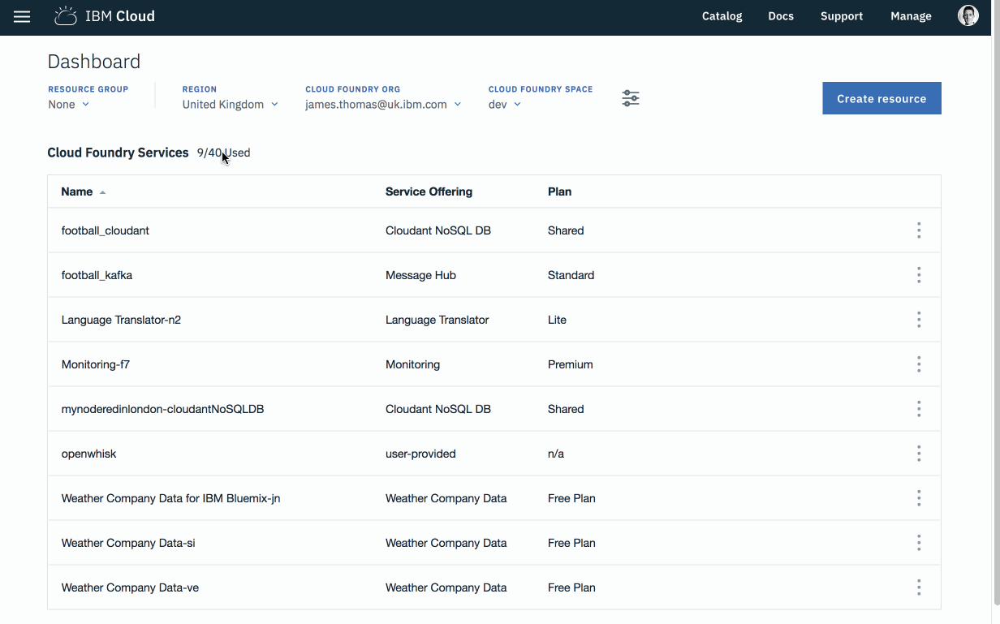
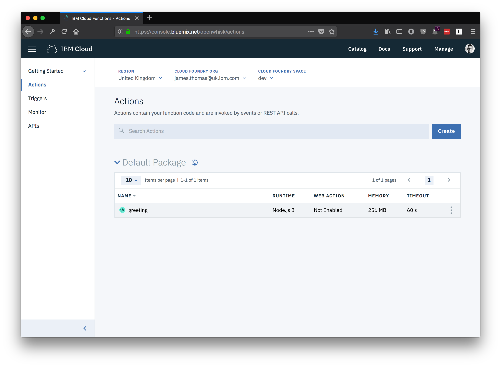
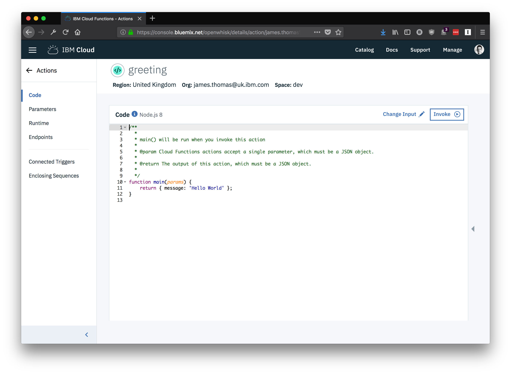
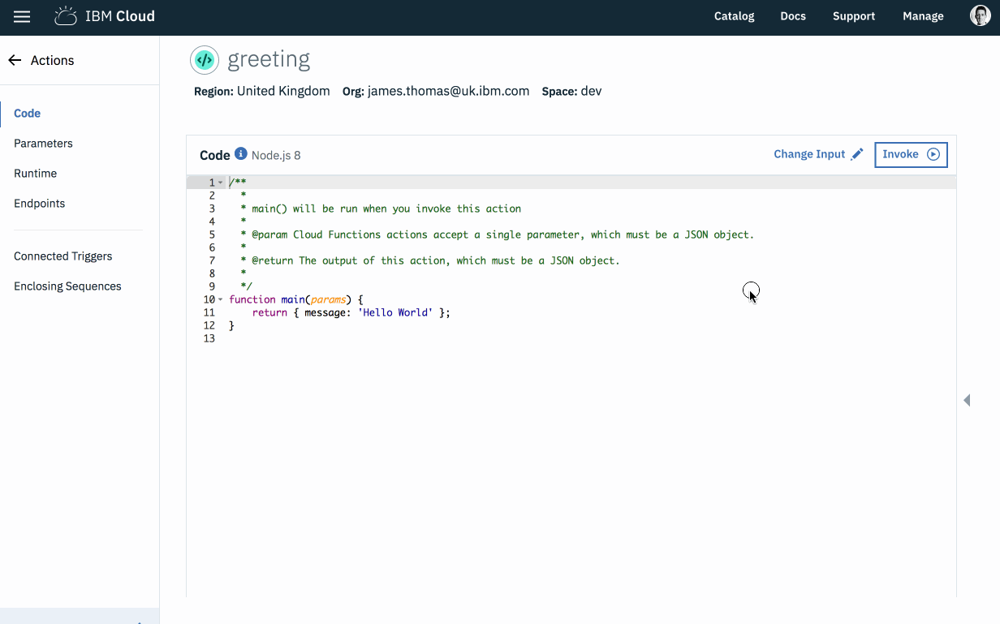
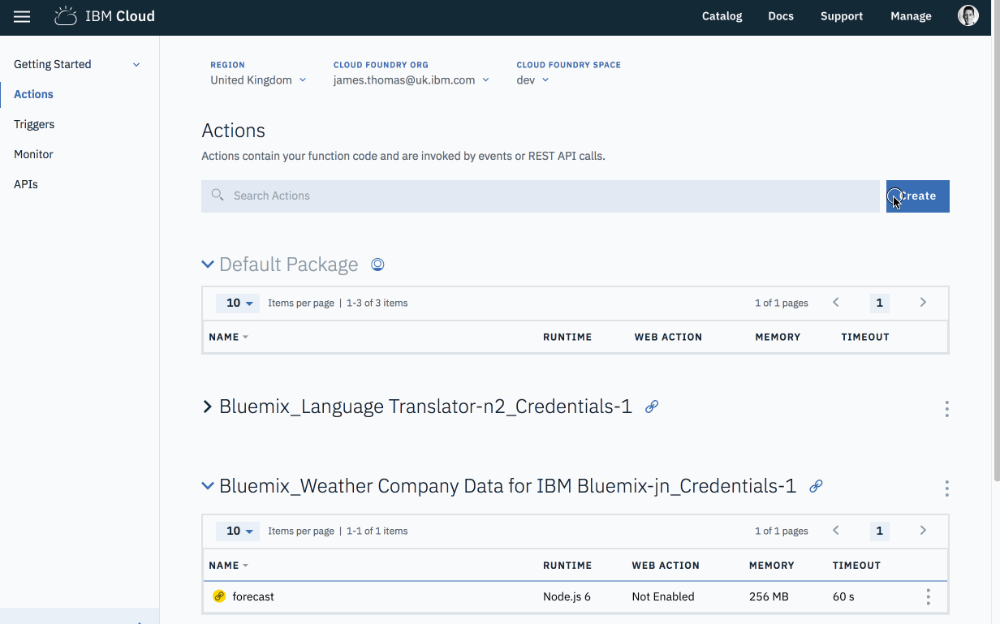
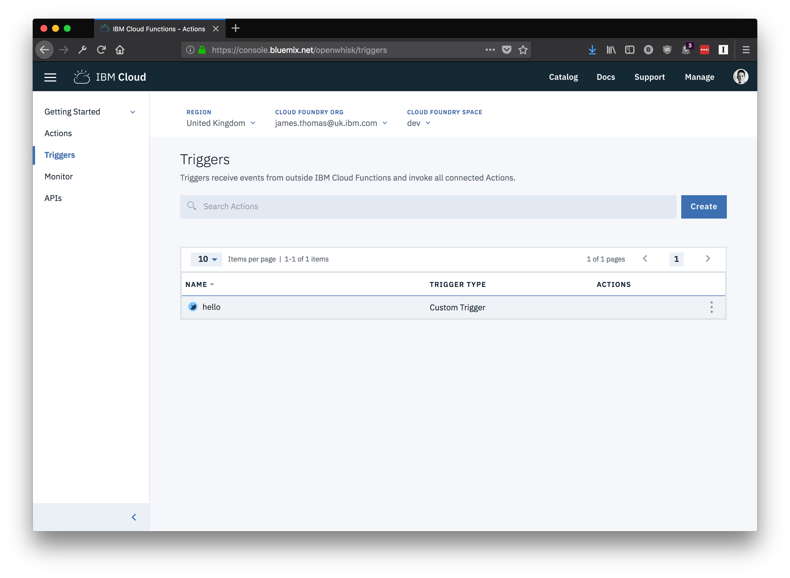
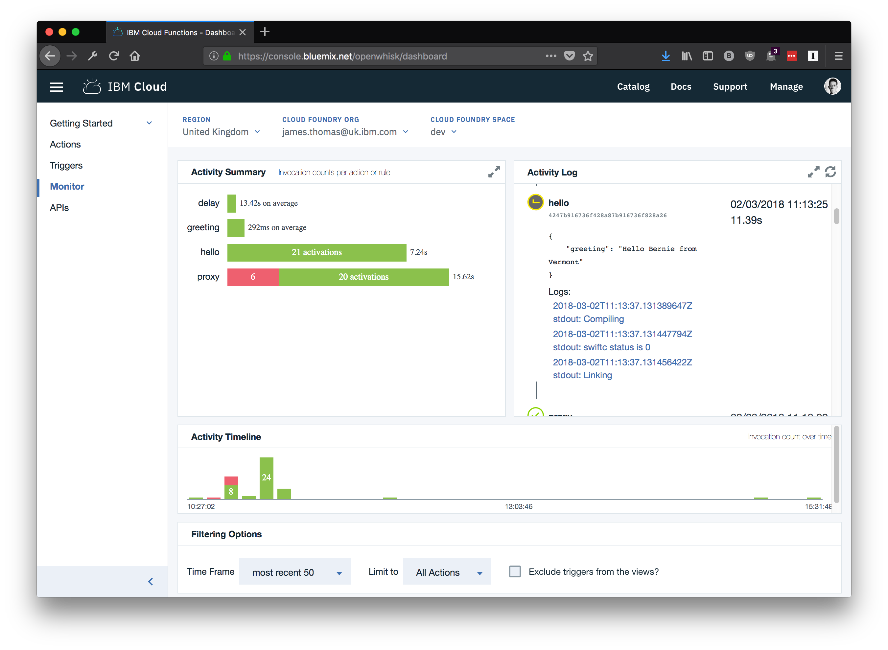
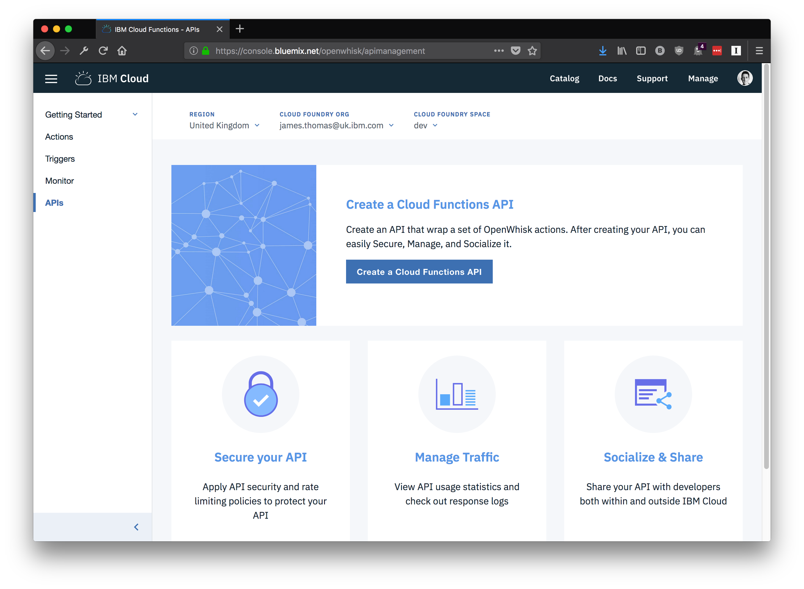
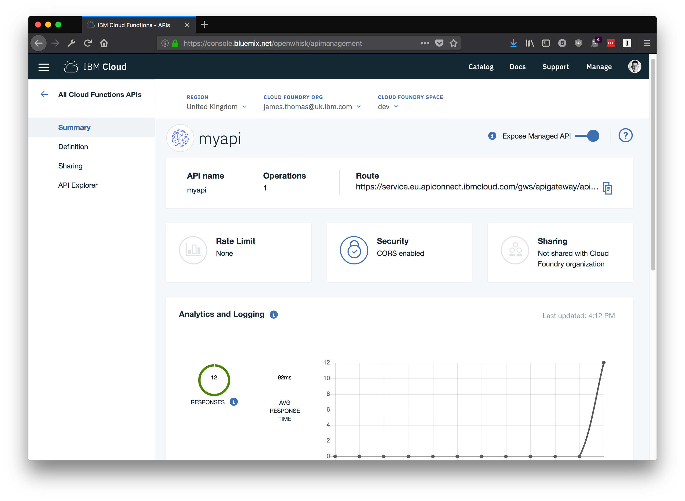
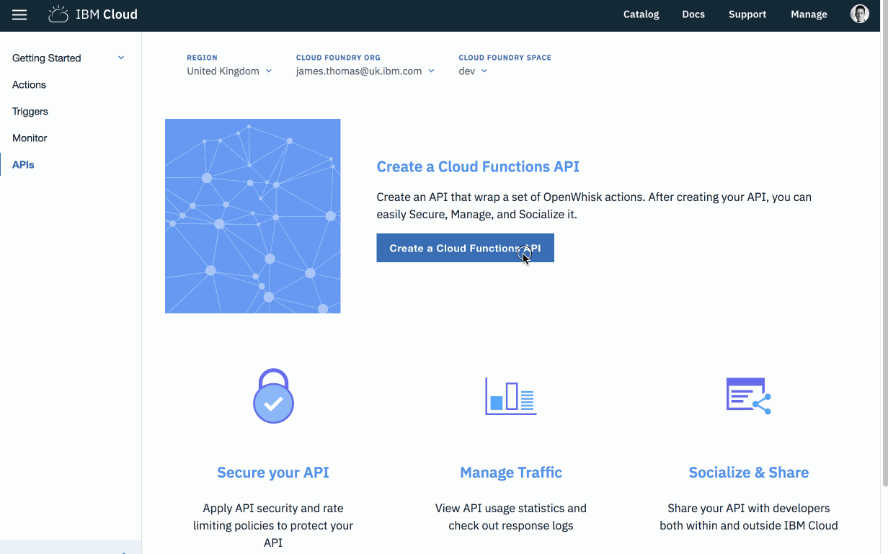

# ibm cloud functions web ui

This exercise will introduce the [IBM Cloud Functions Web UI](https://console.bluemix.net/openwhisk/). This application helps to manage your IBM Cloud Functions applications from a web browser, rather than using the command-line.

*Once you have completed this exercise, you will have…*

- **Understood how to find and use the IBM Cloud Functions Web UI.**

Once this exercise is finished, you will be able to use the web ui to build and manage serverless applications on IBM Cloud!

## Table Of Contents

* [Background](#background)
* [Navigating To The IBM Cloud Functions Homepage](#navigating-to-the-ibm-cloud-functions-homepage)
* [Actions](#actions)
  * [Details Overview](#details-overview)
  * [Invoking Actions](#invoking-actions)
  * [Creating Actions](#creating-actions)
* [Triggers](#triggers)
  - [Details Overview](#details-overview)
  - [Creating Triggers](#creating-triggers)
* [Monitoring](#monitoring)
* [APIs](#apis)
  - [Details Overview](#details-overview)
  - [Creating APIs](#creating-apis)

## Instructions

### Background

IBM Cloud Functions comes with a Web UI to help developers manage their serverless applications. Common development tasks such as creating actions, monitoring invocations, setting up triggers and more can all be achieved using this web application. The web application is custom to IBM Cloud and not part of the open-source Apache OpenWhisk project.

It can often be quicker to use the Web UI for certain development tasks, rather than typing repetitive CLI commands. The web UI integrates with the IBM Cloud interface, making it easy to provision and connect new cloud services to your applications.

In this exercise, we'll show you the different features of the IBM Cloud Web UI….

### Navigating To The IBM Cloud Functions Homepage

1. Open the [IBM Cloud homepage](https://console.bluemix.net).

2. Click to show the menu on the left-hand side.

3. Click "Functions" in the list to open the [IBM Cloud Functions homepage](https://console.bluemix.net/openwhisk/).

   

### Actions

1. Select "Actions" from the left-hand menu panel on the homepage.

[This page](https://console.bluemix.net/openwhisk/actions) is the management page for actions. It shows actions within the chosen region, org and space.

2. Select an action from the page to move to the action details page.

#### Details Overview

The action details page will show properties for the chosen action.

For supported runtimes, action source code is shown in an editor which allows users to make changes live. 

Using the menu on the left-hand side, different properties for the action can be accessed and modified.

- *"Code"* - shows action source code in editor.
- *"Parameters"* - shows default parameters for the action.
- *"Runtime"* - shows the action runtime, timeout value and memory limit.
- *"Endpoints"* - allows you to expose the action as web action.
- *"Connected Triggers"* - shows the triggers action is connected to.
- *"Enclosing Sequences"* - shows sequences which use this action.

#### Invoking Actions

1. Click the "Invoke" button to invoke an action and display the resulting activation record.

*Input parameters to invocations can be modified using the "Change Input" button.*

#### Creating Actions

From the [action overview page](https://console.bluemix.net/openwhisk/actions), new actions can be created by providing the source code through the browser-based editor.

1. Select the "Create" button from the page.
2. Choose "Create Action" from the list.
3. Fill in the "Action name" and choose the "Runtime".
4. Click "Create"
5. Fill in the editor with your action source code.

### Triggers

1. Select "Triggers" from the left-hand menu panel on the homepage.

[This page](https://console.bluemix.net/openwhisk/triggers) is the management page for triggers. It shows triggers within the chosen region, org and space.

2. Select a trigger from the page to move to the trigger details page.

#### Details Overview

The trigger details page will show properties for the chosen trigger.

Using the menu on the left-hand side, different properties for the trigger can be accessed and modified.

- *"Connected Actions"* - shows the actions this trigger is connected to.
- *"Parameters"* - shows default parameters for the action.
- *"Endpoints"* - show details on how to fire this trigger remotely.

#### Creating Triggers

From the [trigger overview page](https://console.bluemix.net/openwhisk/triggers), new triggers can be created.

1. Select the "Create" button from the page.
2. Choose "Create Trigger" from the list.
3. Choose "Trigger type" as "Custom Trigger"
4. Fill in "Trigger Name" and "Description"
5. Click "Create"

### Monitoring

IBM Cloud Functions Web UI comes with a [comprehensive visualisation dashboard](https://console.bluemix.net/openwhisk/dashboard) for monitoring serverless applications.

This dashboard shows activations within a region, org and space. Developers can see activation results, invocation times and logging output through the dashboard. Activations displayed can be filtered by name or time window.

### APIs

HTTP endpoints for web actions can be created and managed through the IBM Cloud Functions Web UI. Using this interface is often a lot more intuitive than using the CLI tool for managing more complex APIs.

1. Select "APIs" from the left-hand menu panel on the homepage.

#### Details Overview

The API details page will show properties for the chosen API, including an API monitoring page showing invocations.

Using the menu on the left-hand side, different properties for the API can be accessed and modified.

- *"Summary"* - API overview page and monitoring dashboard for API invocations.
- *"Definition"* - API configuration properties, allows updating properties live.
- *"Sharing"* - Configure exposing API with our internal users.
- *"API Explorer"* - API documentation for your endpoints.

#### Creating APIs

1. Click the "Create API" from the [APIs homepage](https://console.bluemix.net/openwhisk/apimanagement).

In this page, API details can either be filled out manually or imported from an existing Swagger file.

2. Fill out the "API name" field as "myapi"
3. Fill out the "Base path for API" field as "/api"

4. Click on the "Create Operation" button to add new HTTP endpoints to this API.
5. Fill out the "Path" field as "/hello"
6. Choose an action from the drop-down list.
7. Click the "Create" button.

Using the API management create page, security, rate limiting, CORS or oauth support can be configured.

8. Click the "Save" button to create your API.

