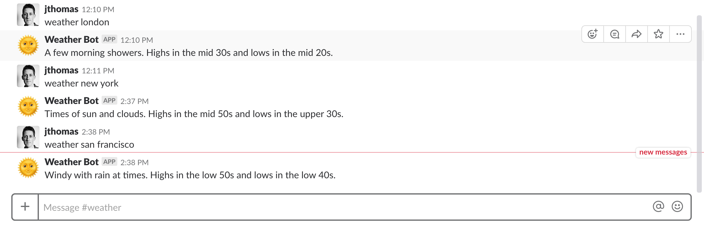
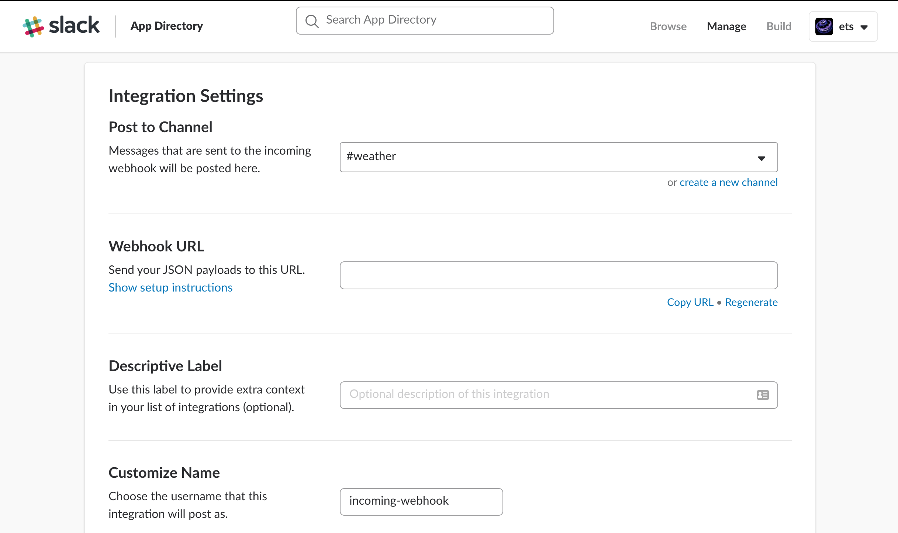
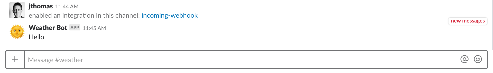
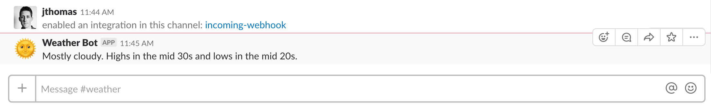
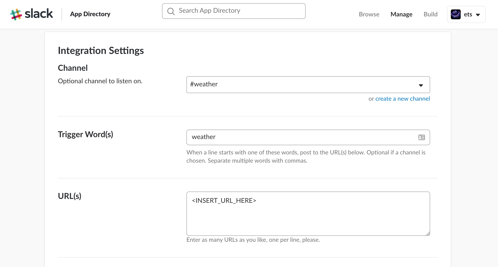

# building a weather bot

This exercise shows you how to build a weather bot for Slack. Combining actions and sequence with webhooks, this bot will allow you to get forecasts for locations on demand.

*Once you have completed this exercise, you will have…*

- **Implemented Weather Bot using independent multiple actions.**
- **Exposed service as public HTTP endpoint.**
- **Integrated with Slack using webhooks.**
- **Connected to alarm trigger for recurring forecast.**

Once this exercise is finished, you will be able to creating Slack bots using IBM Cloud Functions!

## Table Of Contents

* [Background](#background)
* [Actions](#actions)
  * [Address To Location Service](#address-to-location-service)
  * [Forecast From Location Service](#forecast-from-location-service)
  * [Sending Messages To Slack](#sending-messages-to-slack)
* [Creating Weather Bot Using Sequences](#creating-weather-bot-using-sequences)
* [Connecting To Slack](#connecting-to-slack)
  * [Exposing API for Weather Bot](#exposing-api-for-weather-bot)
  * [Slack Outgoing Webhook](#slack-outgoing-webhook)
* [Connecting To Triggers](#connecting-to-triggers)
  * [Setting Up A Morning Forecast](#setting-up-a-morning-forecast)

## Instructions

### Background

This exercise creates a bot for Slack that helps users with weather forecasts. Users can ask the bot for the forecast for a specific location by sending a chat message. The bot can also be configured to send the forecast for a location at regular intervals, e.g. everyday at 8am.

Here's an example of weather bot in action…



This bot needs to perform a few functions, e.g. convert addresses to locations, retrieve weather forecasts for locations and integrate with Slack. Rather than implementing the bot as a monolithic action, containing all the business logic for these features, we are going to create separate actions for each service. We can then use sequence to compose the "meta-action" from these independent services to create the bot.

*Let's start by identifying the individual actions we need and creating them…*

### Actions

#### Address To Location Service

This service handles retrieving `latitude` and `longitude` coordinates for addresses using an external Geocoding API.

The action (microservice) implements the application logic within a single function (`main`) just the way we have learned it earlier. The same way we did it before, parameters are passed in as an object argument (`params`) to the function call. The service makes an API call to the *Google* Geocoding API, returning the results from the calls' response for the first address match.

Let's first create the action (name it `location_to_latlong`) using the following code. As said before, you can create it using the CLI or the OpenWhisk UI just the way you have learned it earlier:

##### Node.js

```javascript
var request = require('request')

function address (params) {
  return params.trigger_word
    ? params.text.slice(params.trigger_word.length).trim() : params.text
}

function main (params) {
  var options = {
    url: 'https://maps.googleapis.com/maps/api/geocode/json',
    qs: {address: address(params)},
    json: true
  }

  return new Promise(function (resolve, reject) {
    request(options, function (err, resp) {
      if (err) {
        console.log(err)
        return reject({err: err})
      }

      if (resp.body.status !== 'OK') {
        console.log(resp.body.status)
        return reject({err: resp.body.status})
      }

      resolve(resp.body.results[0].geometry.location)
    })
  })
}
```

##### Swift

```swift
import KituraNet
import Foundation
import SwiftyJSON

func httpRequestOptions(address: String) -> [ClientRequest.Options] {
  let request: [ClientRequest.Options] = [ 
    .method("GET"),
    .schema("https://"),
    .hostname("maps.googleapis.com"),
    .path("/maps/api/geocode/json?address=\(address)")
  ]

  return request
}

func addressToLocationJson (address: String) -> JSON? {
  var json: JSON = nil
  let req = HTTP.request(httpRequestOptions(address: address)) { resp in
    if let resp = resp, resp.statusCode == HTTPStatusCode.OK {
      do {
        var data = Data()
        try resp.readAllData(into: &data)
        json = JSON(data: data)
      } catch {
        print("Error \(error)")
      }
    } else {
      print(resp!.statusCode)
      print("Status error code or nil reponse received from geocoding server.")
    }
  }
  req.end()

  return json
}

func parseAddress(args: [String: Any]) -> String? {
  guard let text = args["text"] as? String else {
    return nil
  }

  if let trigger_word = args["trigger_word"] as? String {
    return String(text.characters.dropFirst(trigger_word.characters.count)).trimmingCharacters(in: .whitespacesAndNewlines)
  }

  return text
}

func main(args: [String:Any]) -> [String:Any] {
  guard let address = parseAddress(args: args) else {
    return [ "error": "Missing mandatory argument: address" ]
  }

  print("Searching for forecast in \(address)")
  guard let json = addressToLocationJson(address: address) else {
    return [ "error": "Unable to lookup location for address." ]
  }
  
  guard let location = json["results"][0]["geometry"]["location"].dictionaryObject else {
    return [ "error": "Location missing from results." ]
  }

  return location
}
```

Let's deploy the action the way you learned it earlier:

```
$ bx wsk action create location_to_latlong location_to_latlong.xxx
ok: created action location_to_latlong
```

Next, let's test the action:

```
$ bx wsk action invoke location_to_latlong -b -r -p text "London"
{
    "lat": 51.5073509,
    "lng": -0.1277583
}
```

#### Forecast From Location Service

Now, let's implement the service for finding forecasts for locations.

This service uses an external API to retrieve weather forecasts for locations, returning the text description for weather in the next twenty fours hours.

**Please ask the workshop coordinator for the temporary API keys to use this service.**

Again, let's create the action (name it `forecast_from_latlong`) using the following code:

##### Node.js

```javascript
var request = require('request');

function main(params) {
  if (!params.lat) return Promise.reject("Missing latitude");
  if (!params.lng) return Promise.reject("Missing longitude");
  if (!params.username || !params.password) return Promise.reject("Missing credentials");

  var url = "https://twcservice.mybluemix.net/api/weather/v1/geocode/"+params.lat+"/"+params.lng+"/forecast/daily/3day.json";
  var options = {
    url: url,
    json: true,
    auth: {
      user: params.username,
      password: params.password
    }
  };

  return new Promise(function (resolve, reject) {
    request(options, function (err, resp) {
      if (err) {
        return reject({err: err})
      }

      resolve({text: resp.body.forecasts[0].narrative});
    });
  });
}
```

##### Swift

```swift
import KituraNet
import Foundation
import SwiftyJSON

func httpRequestOptions(auth: (username: String, password: String), location: (lat: Double, lng: Double)) -> [ClientRequest.Options] {
  let request: [ClientRequest.Options] = [ 
    .method("GET"),
    .schema("https://"),
    .hostname("twcservice.mybluemix.net"),
    .path("/api/weather/v1/geocode/\(location.lat)/\(location.lng)/forecast/daily/3day.json"),
    .username(auth.username),
    .password(auth.password)
  ]

  return request
}

func forecastForLocationJson(auth: (String, String), location: (Double, Double)) -> JSON? {
  var json: JSON = nil
  let req = HTTP.request(httpRequestOptions(auth: auth, location: location)) { resp in
    if let resp = resp, resp.statusCode == HTTPStatusCode.OK {
      do {
        var data = Data()
        try resp.readAllData(into: &data)
        json = JSON(data: data)
      } catch {
        print("Error \(error)")
      }
    } else {
      print("Status error code or nil reponse received from geocoding server.")
    }
  }
  req.end()

  return json
}

func parseLocation(args: [String:Any]) -> (Double, Double)? {
  guard let lat = args["lat"] as? Double else {
    return nil
  }

  guard let lng = args["lng"] as? Double else {
    return nil
  }

  return (lat, lng)
}

func parseAuthCredentials(args: [String:Any]) -> (String, String)? {
  guard let username = args["username"] as? String else {
    return nil
  }

  guard let password = args["password"] as? String else {
    return nil
  }

  return (username, password)
}

func main(args: [String:Any]) -> [String:Any] {
  guard let location = parseLocation(args: args) else {
    return [ "error": "Missing mandatory location arguments: lat, lng" ]
  }

  guard let auth = parseAuthCredentials(args: args) else {
    return [ "error": "Missing mandatory authentication arguments: username, password" ]
  }

  guard let json = forecastForLocationJson(auth: auth, location: location) else {
    return [ "error": "Unable to lookup forecast for location." ]
  }
  
  guard let forecast = json["forecasts"][0]["narrative"].string else {
    return [ "error": "Narrative forecast missing from results." ]
  }

  return ["text": forecast]
}
```

Notice that the service expects four parameters, `lat` and `lng` coordinates along with the `API credentials` (the ones you noted down before). Passing in `API credentials` as parameters means you don't have to embed them within the code and can change them dynamically at runtime.

Let's deploy this service and verify it's working…

```
$ bx wsk action create forecast_from_latlong forecast_from_latlong.xyz
ok: created action forecast_from_latlong
$ bx wsk action invoke forecast_from_latlong -p lat "51.50" -p lng "-0.12" -p username $WEATHER_USER -p password $WEATHER_PASS -b -r
{
    "text": "Partly cloudy. Lows overnight in the low 60s."
}
```

Yep, looks good.

We don't want to pass in the API credentials with every request, so let's bind them as default parameters to the action. This means we only need to invoke the service with the latitude and longitude parameters, which matches the output from the previous service.

```
$ bx wsk action update forecast_from_latlong -p username $WEATHER_USER -p password $WEATHER_PASS
ok: updated action forecast_from_latlong
$ bx wsk action invoke forecast_from_latlong -p lat "51.50" -p lng "-0.12"  -b -r
{
    "text": "Partly cloudy. Lows overnight in the low 60s."
}
```

Okay, great, that's the first two services working.

#### Sending Messages To Slack

Once we have a forecast, we need to send it to Slack as a message from our bot. Slack provides an easy method for writing simple bots using their webhook integration. [Incoming Webhooks](https://api.slack.com/incoming-webhooks) provide applications with URLs to send data to using normal HTTP requests. The contents of the JSON request body will be posted into the channel as a bot message. 

**Do you have access to a Slack team you can use for testing?**

*If not, please visit open <https://slack.com/> and click the `Create new team` link at the very top of the screen. Follow the instructions to create a new Slack team you can use with the weather bot.*

We now need to configure a webhook to post messages from Slack to our bot.

1. Create a new [Incoming Webhook Integration](https://my.slack.com/services/new/incoming-webhook/) for your channel and copy the URL provided by Slack to use with our bot. 
   

Once we have the webhook endpoint, we could write another action to send forecasts to that URL but OpenWhisk comes with integrations for a number of third-party systems meaning we don't have to! 

These integrations are available as _packages_, which bundle Actions and Trigger Feeds and make them available to all users in the system. We can see what packages are available using the following command...

```
$ bx wsk package list /whisk.system
packages
/whisk.system/samples                                                  shared
/whisk.system/watson-textToSpeech                                      shared
/whisk.system/watson-translator                                        shared
/whisk.system/watson-speechToText                                      shared
/whisk.system/combinators                                              shared
/whisk.system/github                                                   shared
/whisk.system/utils                                                    shared
/whisk.system/websocket                                                shared
/whisk.system/slack                                                    shared
/whisk.system/weather                                                  shared
/whisk.system/pushnotifications                                        shared
/whisk.system/alarms                                                   shared
/whisk.system/cloudant                                                 shared
/whisk.system/messaging                                                shared
```

Looks like there's a Slack integration already. Retrieving the package summary will tell us more. 

```
$ bx wsk package get --summary /whisk.system/slack
package /whisk.system/slack: This package interacts with the Slack messaging service
   (parameters: channel, token, url, username)
 action /whisk.system/slack/post: Post a message to Slack
   (parameters: text)
```

The `/whisk.system/slack/post` action allows us to post messages to Slack without writing any code. 

```
$ bx wsk action invoke /whisk.system/slack/post -p text "Hello" -p channel $CHANNEL -p url $WEBHOOK_URL
ok: invoked /whisk.system/slack/post with id 78070fe2acb54c70ae49c0fa047aee51
```

Seeing the message pop-up in our Slack channel verifies this works. 

We need to bind default parameters to configure the URL, channel, bot name and icon. This requires us to copy the action to over local workspace.

```
$ bx wsk action create --copy webhook /whisk.system/slack/post -p url $WEBHOOK -p channel $CHANNEL -p username "Weather Bot" -p icon_emoji ":sun_with_face:"
ok: created action webhook
```

This customised Slack service can be invoked with just the _text_ parameter and gives us a friendly bot message in the #weather channel.

```
$ bx wsk action invoke webhook -p text "Hello"
```



### Creating Weather Bot Using Sequences

Right, we have the three microservices to handle the logic in our bot. How can we join them together to create our application?

***OpenWhisk comes with a feature to help with this, called Sequences.***

Sequences allow you to define actions that are composed by executing other actions in order, passing the output from one service as the input to the next. This is a bit like Unix pipes, where a single command executes multiple commands and pipes the output through the commands.

Let's define a new sequence for our bot to join these services together.

```
$ bx wsk action create location_forecast --sequence location_to_latlong,forecast_from_latlong,webhook
ok: created action location_forecast
```

With this meta-service defined, we can invoke the `location_forecast` action with the input parameter for the first service (`text`). As a result the forecast for that location should appear in *Slack*.

Let's test this. The result should look similar to this:

```
$ bx wsk action invoke location_forecast -p text "London" -b
ok: invoked location_forecast with id d63b40bb36c54cfbaf8262b6f7e5c2e9
{
    "activationId": "d63b40bb36c54cfbaf8262b6f7e5c2e9",
    "annotations": [],
    "end": 1473179750086,
    "logs": [],
    "name": "location_forecast",
    "namespace": "andreas.nauerz@de.ibm.com",
    "publish": false,
    "response": {
        "result": {},
        "status": "success",
        "success": true
    },
    "start": 1473179746914,
    "subject": "user@host.com",
    "version": "0.0.1"
}
```



### Connecting To Slack

How can users ask weather bot for forecasts about a location?

Slack provides [Outgoing Webhooks](https://api.slack.com/outgoing-webhooks) that will post JSON messages to external URLs when keywords appear in channel messages. Setting up a new outgoing webhook for our channel will allow users to say "weather london" and have the bot respond.

#### Exposing API for Weather Bot

Exposing the Weather Bot service as an public API endpoint allows us to handle webhook notifications from Slack.

1. Update the `location_forecast` action to be a Web Action.

```
$ bx wsk action update location_forecast --web true
ok: updated action location_forecast
```

2. Create a new API endpoint (`/api/bot`) for this service that responds to POST requests.

```
$ bx wsk api create /api/bot POST location_forecast -n "weather bot"
ok: created API /api/bot POST for action /_/location_forecast
https://service.us.apiconnect.ibmcloud.com/gws/apigateway/api/<UUID>/api/bot
```

3. Test the API endpoint with an example message.

```
$ curl -XPOST "https://service.us.apiconnect.ibmcloud.com/gws/apigateway/api/<UUID>/api/bot?text=london"
```

Weather bot should post the forecast into your channel!


#### Slack Outgoing Webhook

Hence, we need to make sure that our action is being properly invoked once a message starting with a defined trigger word is being send via the `weather` channel we have created prior.

1. Browse to the "[App Directory](https://ets-hursley.slack.com/apps)" for your Slack team.
2. Search for "Outgoing WebHooks"
3. Click "Add Configuration" and then "Add Outgoing WebHooks integration"
4. Under the "Integration Settings" panel, select the following settings.
   - *Channel* -> Choose an existing channel
   - *Trigger word(s)* -> "weather"
   - *URL(s)* -> Weather Bot API URL.
5. Click "Saving Settings"



With the webhook integration configured, enter the channel you selected and type the following message: `weather london`. The bot should now respond with the current forecast!


Test it out with different locations like `weather new york` or `weather san francisco`.

### Connecting To Triggers

Triggers are used to represent event streams from the external world into OpenWhisk. They can be invoked manually, through the REST API, or automatically, after connecting to trigger feeds.

Actions can be bound to Triggers using Rules. When a Trigger is fired, the Action is invoked with the request parameters. Multiple Actions can listen to the same Trigger.

Let's now look at binding the bot service to a sample trigger and invoke it indirectly by firing that trigger:

```
$ bx wsk trigger create forecast
ok: created trigger forecast

$ bx wsk rule create forecast_rule forecast location_forecast
ok: created rule forecast_rule

$ bx wsk trigger fire forecast -p text "London"
ok: triggered forecast with id 49914a20416d416d8c90282d59eebee3
```

Once we fired the trigger, passing in the `text` parameter, the bot was automatically invoked and posted the forecast for `London` to the channel.

Now let's look at invoking the bot every morning to tell us the forecast before we set off for work.

#### Setting Up A Morning Forecast

Triggers can be registered to listen to exteral event sources, like messages on a queue or updates to a database.

Whenever a new external event occurs, the trigger will be fired automatically. If we have Actions bound via Rules to those Triggers, they will also be invoked.

Triggers bind to external event sources during creation by passing in a reference to the external trigger feed to connect to. OpenWhisk's public packages contain a number of trigger feeds that we can use for external event sources.

One of those public trigger feeds is in the Alarm package. This alarm feed executes triggers at pre-specified intervals. Using this feed with our weather bot trigger, we could set it up to execute every morning for a particular address and tell us the forecast every for London before we set off for work.

Let's do that now...

```
$ bx wsk package get /whisk.system/alarms --summary
package /whisk.system/alarms: Alarms and periodic utility
   (parameters: cron trigger_payload)
 feed   /whisk.system/alarms/alarm: Fire trigger when alarm occurs

$ bx wsk trigger create regular_forecast --feed /whisk.system/alarms/alarm -p cron "*/10 * * * * *" -p trigger_payload "{\"text\":\"London\"}"
ok: created trigger feed regular_forecast

$ bx wsk rule create regular_forecast_rule regular_forecast location_forecast
ok: created rule regular_forecast_rule
```

The trigger schedule is provided by the `cron` parameter, which we've set up to run every ten seconds to test it out. By binding this new trigger to our bot service, the forecast for London starts to appear in the channel.

Okay, that's great but let's turn off this alarm before it drives us mad:

```
$ bx wsk rule disable regular_forecast_rule
ok: rule regular_forecast_rule is inactive
```