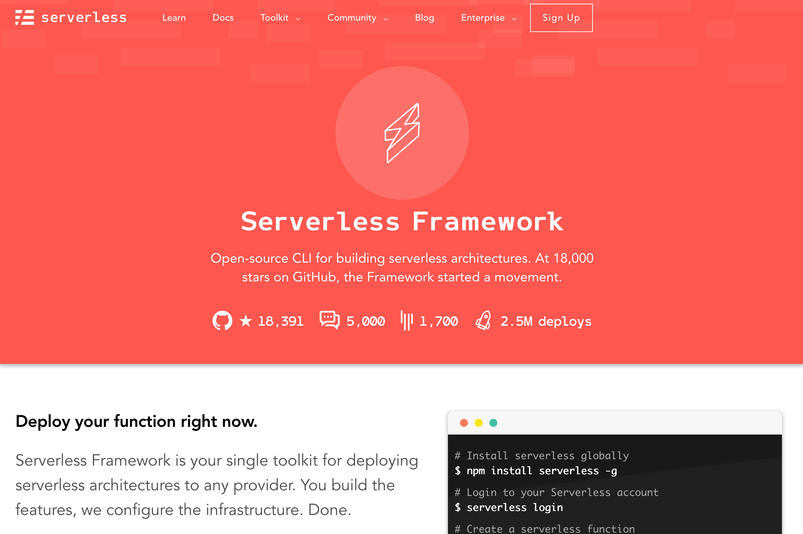

# using the serverless framework

This exercise shows you use IBM Cloud Functions with The Serverless Framework. The Serverless Framework is the most popular framework for building serverless applications. It manages the build, packaging, configuration and deployment process for serverless applications and their resources.

*Once you have completed this exercise, you will have…*

- **Installed The Serverless Framework and OpenWhisk provider plugin.**
- **Understood how to create, deploy and test projects from templates.**
- **Modified projects to add actions and connect actions to event sources.**

Once this exercise is finished, you will be able to use a popular development framework for creating serverless applications!

## Table Of Contents

* [Background](#background)
* [Install The Serverless Framework](#installing-the-serverless-framework)
* [Creating Project Templates](#creating-project-templates)
  * [Serverless Framework Files](#serverless-framework-files)
  * [Deploying Projects](#deploying-projects)
  * [Testing Actions](#testing-actions)
* [Adding Actions](#adding-actions)
* [Connecting API Endpoints](#connecting-api-endpoints)
* [Working with Triggers and Rules](#working-with-triggers-and-rules)
* [Deploying Pre-compiled Binaries (Swift)](#deploying-pre-compiled-binaries-(swift))
  * [Project Layout](#project-layout)
  * [serverless.yml](#serverless.yml)
  * [package.json](#package.json)
  * [Deploying](#deploying)

## Instructions

### Background

*[The Serverless Framework](https://serverless.com/framework/)* is the most popular open-source framework for building serverless applications. Launching back in 2015, the framework has experienced tremendous growth and now has over twenty thousands stars on [Github](https://github.com/serverless/serverless).



Thousands of developers are using the tool to build serverless applications every day.

Using a [simple manifest file](https://serverless.com/framework/docs/providers/openwhisk/guide/serverless.yml/), developers can define serverless functions, connect them to event sources and declare cloud services needed by their application.

```yaml
service: swift-service

provider:
  name: openwhisk
  runtime: swift

functions:
  ping:
    handler: ping.main

plugins:
- serverless-openwhisk
```

The framework handles deploying these serverless applications to the cloud provider. It also allows developers to monitor services in production, roll-out updates and assist debugging issues.

It also has a [vibrant ecosystem](https://github.com/serverless/serverless#plugins-v10) of third-party plugins to extend the functionality of the framework.

With the aforementioned integration developers using the framework can now choose to deploy their serverless applications to any Apache OpenWhisk platform instance. Multi-provider support also means moving applications between platforms is much easier and developers can even develop multi-cloud serverless applications.

### Installing The Serverless Framework

The framework is a Node.js [CLI application](https://www.npmjs.com/package/serverless) which can be installed with the [Node.js Package Manager](https://www.npmjs.com/) (NPM). Installing the project as a [global package](https://docs.npmjs.com/getting-started/installing-npm-packages-globally) makes the CLI tool (`serverless`) available as a terminal command.

1. Install Node.js and NPM if you don't have these runtimes installed.
   - https://github.com/creationix/nvm
2. Install The Serverless Framework with the OpenWhisk provider plugin.

```
$ npm install --global serverless
...
+ serverless@1.27.3
added 339 packages in 11.545s
```

3. Check the CLI tool is installed and working.

```
$ serverless --version
1.27.3
```

### Creating Project Templates

The Serverless Framework supports bootstrapping new serverless application from existing templates. The frameworks provides numerous templates for each serverless platform and runtime. Templates can be deployed without modification.

*Templates for the following runtimes with Apache OpenWhisk are available:* `nodejs`, `php`, `python` and `swift`.

Let's try out one of the OpenWhisk templates to show you the workflow when using the framework.

-  Use the `create` command to create a new service from one of the templates.

```
$ serverless create --template openwhisk-nodejs --path my_service
// OR
$ serverless create --template openwhisk-swift --path my_service
```

- Look at the templates files in the new `my_service` directory.

```
$ cd my_service; tree .
.
├── README.md
├── package.json
├── ping.swift
└── serverless.yml

0 directories, 4 files
```

- Install project dependencies using NPM.

```
$ npm install
`-- serverless-openwhisk@0.13.0
...
```

#### Serverless Framework Files

Application configuration for serverless functions and services is maintained in the `serverless.yml` file. Functions are defined in this file, along with event sources and the configuration parameters.

Let's look at the example application defined by the template…

```yaml
service: my_service

provider:
  name: openwhisk
  runtime: swift

functions:
  hello:
    handler: ping.main

plugins:
  - serverless-openwhisk
```

This configuration defines a single action `hello` which uses the `main` function from the  `ping.swift` file.

```swift
func main(args: [String:Any]) -> [String:Any] {
    let formatter = DateFormatter()
    formatter.dateFormat = "yyyy-MM-dd HH:mm:ss"
    let now = formatter.string(from: Date())

    if let name = args["name"] as? String {
      return [ "greeting" : "Hello \(name)! The time is \(now)" ]
    } else {
      return [ "greeting" : "Hello stranger! The time is \(now)" ]
    }
}
```

#### Deploying Projects

1. Use the `deploy` command to deploy the serverless application using the framework.

```
$ serverless deploy
```

*If the deployment succeeds, the following messages will be printed to the console:*

```
Serverless: Packaging service...
Serverless: Excluding development dependencies...
Serverless: Compiling Functions...
Serverless: Compiling API Gateway definitions...
Serverless: Compiling Rules...
Serverless: Compiling Triggers & Feeds...
Serverless: Deploying Functions...
Serverless: Deployment successful!

Service Information
platform:	openwhisk.ng.bluemix.net
namespace:	_
service:	my_service

actions:
my_service-dev-hello

triggers:
**no triggers deployed**

rules:
**no rules deployed**

endpoints (api-gw):
**no routes deployed**

endpoints (web actions):
**no web actions deployed**
```

#### Testing Actions

The `invoke` command can be used to test actions once they have been deployed.

1. Test this out with the `hello` action you have just deployed…

```
$ serverless invoke --function hello
{
    "greeting": "Hello stranger! The time is 2018-03-01 11:27:16"
}
```

2. Test again with parameters.

```
$ serverless invoke --function hello --data '{"name": "OpenWhisk"}'
{
    "greeting": "Hello OpenWhisk! The time is 2018-03-01 11:27:26"
}
```

### Adding Actions

If you want to add more actions to your project, create the source files and update the `serverless.yml`.

1. Add a new function `today` to `ping.swift`

```swift
func today(args: [String:Any]) -> [String:Any] {
    let formatter = DateFormatter()
    formatter.dateFormat = "EEEE"
    let now = formatter.string(from: Date())
    return [ "greeting" : "Today is \(now)!" ]
}
```

2. Add a new action to the `serverless.yml` configuration

```yaml
service: my_service

provider:
  name: openwhisk
  runtime: swift

functions:
  hello:
    handler: ping.main
  today:
    handler: ping.today

plugins:
  - serverless-openwhisk
```

3. Deploy the updated service.

```
$ serverless deploy
...

actions:
my_service-dev-today    my_service-dev-hello
```

4. Invoke the `today` action.

```
$ serverless invoke -f today
{
    "greeting": "Today is Thursday!"
}
```

### Connecting API Endpoints

API endpoints can be defined directly in the `serverless.yml` configuration. The framework will configure the endpoints during the deployment process. Let's test this out now…

1. Open the `serverless.yml` file and define an API endpoint for the `hello` action.

```yaml
functions:
    hello:
        handler: ping.main
        events:
            - http: GET /api/hello
```

2. Redeploy the service.

```
$ serverless deploy
...
endpoints (api-gw):
GET https://service.us.apiconnect.ibmcloud.com/gws/apigateway/api/<UUID>/my_service/api/hello --> my_service-dev-hello

endpoints (web actions):
https://openwhisk.ng.bluemix.net/api/v1/web/user@host.com_dev/default/my_service-dev-hello
```

3. Test the HTTP endpoint listed from the deploy command output.

```
$ curl https://service.us.apiconnect.ibmcloud.com/gws/apigateway/api/<UUID>/my_service/api/hello
{
  "greeting": "Hello stranger! The time is 2018-03-01 11:55:19"
}
```

### Working with Triggers and Rules

Actions can be connected to other event sources using the same configuration section (`events`) in the `serverless.yml` file.

Here's an example of some of the other [event sources](https://serverless.com/framework/docs/providers/openwhisk/events/) that are supported by the framework.

```yaml
functions:
    [...]
    hello:
        handler: hello.handler
        events:
            - http: GET /api-demo/hello
            - schedule: cron(* * * * *)
            - trigger: triggerName
            - cloudant: 
                host: xxx-yyy-zzz-bluemix.cloudant.com
                username: USERNAME
                password: PASSWORD
                db: db_name
            - message_hub: 
                topic: my_kafka_topic
                brokers: afkaprod01.messagehub.services.us-south.bluemix.net:9093
                user: USERNAME
                password: PASSWORD                     
```

### Deploying Pre-compiled Binaries (Swift)

If we want to deploy pre-compiled binaries for Swift actions, rather than source files, to improve performance or add external libraries, the framework can automate this process.

This [example project](https://github.com/serverless/examples/tree/master/openwhisk-swift-precompiled-binaries) shows you how to set up a project to generate binaries, compiled for the correct architecture, prior to deployment. Let's explain how this work…

1. Checkout the Git repository and enter the project template folder.

```
$ git clone git@github.com:serverless/examples.git
$ cd examples/openwhisk-swift-precompiled-binaries/
```

2. Install project dependencies.

```
$ npm install
```

#### Project Layout

1. Review the template folder files.

```
$ tree .
.
├── Package.swift
├── README.md
├── Sources
│   ├── hello
│   │   └── main.swift
│   └── welcome
│       └── main.swift
├── node_modules
│   ...
├── package-lock.json
├── package.json
└── serverless.yml

7 directories, 10 files
```

This folder implements a standard Swift module layout. Sources files are located in `Sources` with two `main.swift` files which will be converted into executable files.

```swift
import OpenWhiskAction

func hello(args: [String:Any]) -> [String:Any] {
  if let name = args["name"] as? String {
    return [ "greeting" : "Hello \(name)!" ]
  } else {
    return [ "greeting" : "Hello stranger!" ]
  }
}

OpenWhiskAction(main: hello)
```

Source files use the [external Swift library](https://github.com/jthomas/OpenWhiskAction) to register OpenWhisk actions. This dependency is listed in the Swift package manifest.

```swift
import PackageDescription

let package = Package(
    name: "Action",
    dependencies: [
        .Package(url: "https://github.com/jthomas/OpenWhiskAction.git", majorVersion: 0)
    ]
)
```

#### serverless.yml

```yaml
service: swift-packages

provider:
  name: openwhisk
  runtime: swift

functions:
  hello:
    handler: .build/release/hello
  welcome:
    handler: .build/release/welcome

custom:
  scripts:
    hooks:
      'package:initialize': npm run-script compile
plugins:
  - serverless-openwhisk
  - serverless-plugin-scripts
```

This configuration file uses an external plugin (`serverless-plugin-scripts`) to set up a build script (`npm run-script compile`) that is invoked before deployments.

Handlers defined for the `hello` and `welcome` actions refer to the build artefacts rather than source files.

#### package.json

```json
{
  "name": "openwhisk-swift-package-with-precompiled-binaries",
  "version": "1.0.0",
  "description": "Swift packages and pre-compiled binaries on OpenWhisk.",
  "main": "handler.js",
  "scripts": {
    "postinstall": "npm link serverless-openwhisk",
    "compile": "docker run --rm -it -v $(pwd):/swift-package openwhisk/action-swift-v3.1.1 bash -e -c 'cd /swift-package && swift build -v -c release'"
  },
  "keywords": [
    "serverless",
    "openwhisk"
  ],
  "dependencies": {
    "serverless-plugin-scripts": "^1.0.2"
  }
}
```

The `package.json` contains the `compile` script definition which will use Docker to run the swift build process in the platform container. This will ensure binaries are generated for the correct runtime.

#### Deploying

1. Use the framework to deploy the project without any manual steps.

```
$ serverless deploy
> openwhisk-swift-package-with-precompiled-binaries@1.0.0 compile /private/tmp/examples/openwhisk-swift-precompiled-binaries
> docker run --rm -it -v $(pwd):/swift-package openwhisk/action-swift-v3.1.1 bash -e -c 'cd /swift-package && swift build -v -c release'

...
Serverless: Packaging service...
Serverless: Excluding development dependencies...
Serverless: Compiling Functions...
Serverless: Compiling API Gateway definitions...
Serverless: Compiling Rules...
Serverless: Compiling Triggers & Feeds...
Serverless: Deploying Functions...
Serverless: Deployment successful!

Service Information
platform:	openwhisk.ng.bluemix.net
namespace:	_
service:	swift-packages

actions:
swift-packages-dev-hello    swift-packages-dev-welcome
```

2. Test out the actions.

```
$ serverless invoke -f hello
{
    "greeting": "Hello stranger!"
}
$ serverless invoke -f welcome
{
    "greeting": "Welcome stranger!"
}
```
